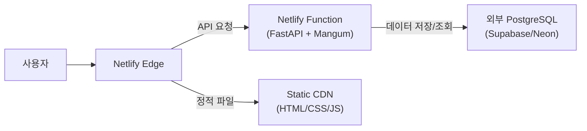

# FastAPI 애플리케이션 Netlify 배포 가이드

본 문서는 현재 개발 중인 **FastAPI + SQLite** 기반의 `insta-lite` 프로젝트를 **Netlify**로 배포하기 위한 절차와 고려사항을 정리한 보고서입니다.

## 1. 프로젝트 현황 및 분석

*   **Framework**: FastAPI
*   **Database**: SQLite (`insta_lite.db`)
*   **Packet Manager**: uv (pyproject.toml)
*   **Deployment Target**: Netlify (요청 사항)

## 2. Netlify 배포 시 핵심 고려사항 (중요)

Netlify는 본래 **정적 웹사이트(Static Site)** 호스팅을 위해 설계되었으며, 최근 **Serverless Functions** (AWS Lambda 기반)를 통해 백엔드 로직을 지원합니다. 하지만 이 구조는 전통적인 서버 호스팅(Render, Railway, AWS EC2 등)과는 다른 특성을 가집니다.

### ⚠️ SQLite 데이터베이스 문제
Netlify Functions는 **Stateless(무상태)**이며 실행 환경의 파일 시스템은 **Ephemeral(일시적)**입니다.
즉, **배포 후 생성된 데이터나 변경된 SQLite 파일(`insta_lite.db`)은 유지되지 않고 초기화됩니다.**

| 특징 | Netlify Functions | Render / Railway / VM |
| :--- | :--- | :--- |
| **실행 방식** | 요청 시에만 실행 (Cold Start) | 상시 실행 (Always On) |
| **파일 시스템** | **읽기 전용 / 일시적 (저장 안 됨)** | 영구 저장소 (Volume) 연결 가능 |
| **DB 적합성** | 외부 DB 필수 (PostgreSQL, MySQL 등) | SQLite 사용 가능 (Volume 연결 시) |

> **결론**: 현재 코드 그대로 Netlify에 배포하면 **회원가입/글쓰기 후 새로고침 시 모든 데이터가 사라집니다.**
> **해결책**:
> 1.  **DB 변경**: SQLite 대신 외부 클라우드 DB(Supabase, Neon, AWS RDS 등)를 사용해야 합니다.
> 2.  **호스팅 변경**: SQLite를 그대로 쓰고 싶다면 Render(Disk 연결)나 Fly.io(Volume 연결)를 권장합니다.

---

## 3. Netlify 배포 아키텍처 (권장 설정)

SQLite 대신 외부 DB를 연결한다고 가정할 때의 아키텍처입니다.



---

## 4. Netlify 배포 단계별 가이드

그래도 Netlify 배포를 진행하시려면 아래 절차를 따라야 합니다.

### 4.1. 필수 패키지 설치
Netlify Functions에서 FastAPI를 실행하기 위해 `mangum` 어댑터가 필요합니다.

```bash
uv add mangum
```

### 4.2. `app.py` 수정
FastAPI 인스턴스를 Mangum으로 감싸는 핸들러를 추가해야 합니다.

```python
# app.py 최하단에 추가
from mangum import Mangum

# ... 기존 코드 ...

handler = Mangum(app)
```

### 4.3. 의존성 파일 생성
Netlify 빌드 시스템이 인식할 수 있도록 `requirements.txt`를 생성합니다.

```bash
uv pip compile pyproject.toml -o requirements.txt
```

### 4.4. `netlify.toml` 설정 파일 생성
프로젝트 루트에 `netlify.toml` 파일을 생성하고 아래 내용을 작성합니다.

```toml
[build]
  command = "pip install -r requirements.txt"
  publish = "static"  # 정적 파일이 위치한 폴더 (없으면 임의 지정)
  functions = "functions" # 함수 빌드 결과물 위치

[functions]
  external_node_modules = [] 

[[redirects]]
  from = "/api/*"
  to = "/.netlify/functions/app"
  status = 200

[[redirects]]
  from = "/*"
  to = "/index.html" # SPA 라우팅 처리가 필요할 경우
  status = 200
```
*참고: 위 설정은 프로젝트 구조에 따라 조정이 필요할 수 있습니다. Python Runtime 설정을 위해 `netlify.toml` 대신 UI 설정을 사용할 수도 있습니다.*

### 4.5. Github 연결 및 배포
1.  변경 사항(Mangum 추가, 설정 파일 등)을 Github에 Push합니다.
2.  [Netlify Dashboard](https://app.netlify.com/)에 로그인합니다.
3.  **"Add new site"** -> **"Import from Git"**을 선택합니다.
4.  현재 Github 리포지토리를 선택합니다.
5.  Build settings에서:
    *   **Build command**: `pip install -r requirements.txt` (혹은 비워둠)
    *   **Publish directory**: `static`
6.  **Environment variables**에 데이터베이스 URL 등을 설정합니다 (외부 DB 사용 시).
7.  **Deploy site**를 클릭합니다.

---

## 5. 대안: Render 배포 (추천)

Github 리포지토리가 이미 연결되어 있으므로, **Render**를 사용하는 것이 SQLite 호환성 면에서(무료 티어에서는 데이터가 초기화되긴 하지만, 유료 디스크 사용 시 보존 가능) 더 설정이 간편할 수 있습니다.

### Render 배포 Web Service 설정
*   **Build Command**: `pip install -r requirements.txt`
*   **Start Command**: `uvicorn app:app --host 0.0.0.0 --port $PORT`

## 6. 요약

*   **현재 상태**: Netlify 배포 시 **데이터 유실** 발생함.
*   **Netlify 배포 시**: 외부 DB(Supabase 등)로 마이그레이션 필수 + `mangum` 설정 필요.
*   **간편 배포 시**: Render 등을 사용하되, 영구 저장이 필요하면 Persistent Disk 옵션 사용 필요.

---
**작성일**: 2026-02-10
**작성자**: Google Antigravity (Requested by User)
