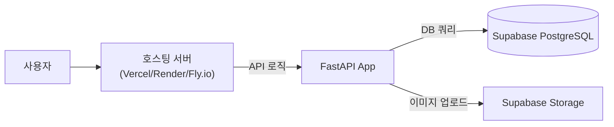

# Supabase 기반 배포 및 마이그레이션 가이드

**Supabase**는 "Open Source Firebase Alternative"를 표방하며, **PostgreSQL 데이터베이스**, **Authentication**, **Storage**, **Edge/Serverless Functions** 등을 올인원으로 제공하는 BaaS(Backend-as-a-Service) 플랫폼입니다.

> **핵심 질문: "Supabase 자체는 웹 페이지를 배포하지 않나요?"**
>
> **네, 맞습니다.** Supabase는 **백엔드(데이터, 인증, API)** 만 제공하며, **프론트엔드 호스팅(HTML/CSS/JS 파일 배포)은 제공하지 않습니다.**
> 따라서 웹 페이지는 **Vercel, Netlify, GitHub Pages** 같은 별도의 호스팅 서비스를 사용해야 합니다. (Firebase가 'Firebase Hosting'을 제공하는 것과 가장 큰 차이점입니다.)

현재 FastAPI 프로젝트를 배포하는 관점에서 Supabase를 활용하는 방법은 크게 두 가지가 있습니다.

---

## 시나리오 A: FastAPI 유지 + Supabase (DB & Storage) 활용 (추천)

현재 작성된 Python(FastAPI) 로직을 그대로 유지하되, **데이터베이스**와 **이미지 저장소**만 Supabase의 인프라를 빌려 쓰는 방식입니다. Vercel/Netlify/Render 등에 FastAPI를 띄우고 Supabase를 백엔드 리소스로 활용하는 구조입니다.

### 1. 아키텍처


### 2. 마이그레이션 작업
이전에 설명한 "SQLite -> PostgreSQL 마이그레이션"과 거의 동일하며, 여기에 **이미지 스토리지** 부분이 추가됩니다.

#### (1) 데이터베이스 (PostgreSQL)
*   **연결**: `sqlite3` 대신 `psycopg2` (혹은 `SQLAlchemy`)를 사용하여 Supabase에서 제공하는 Connection String(`postgres://...`)으로 연결합니다.
*   **코드 수정**: `db.execute("... ? ...")` ➔ `cursor.execute("... %s ...")` (SQL 문법 변경)

#### (2) 스토리지 (이미지 업로드)
현재 `insta-lite`는 로컬 `uploads/` 폴더에 이미지를 저장합니다. 서버리스(Vercel/Netlify) 환경에서는 이 방식이 불가능하므로 **Supabase Storage**를 사용해야 합니다.

*   **라이브러리**: `supabase-py` 설치 (`uv add supabase`)
*   **코드 수정 (`app.py`)**:
    ```python
    # [변경 전] 로컬 파일 저장
    # with open(file_path, "wb") as buffer:
    #     shutil.copyfileobj(image.file, buffer)

    # [변경 후] Supabase Storage 업로드
    from supabase import create_client, Client
    
    supabase: Client = create_client(SUPABASE_URL, SUPABASE_KEY)
    
    # 이미지 업로드
    file_content = await image.read()
    supabase.storage.from_("images").upload(filename, file_content)
    
    # Public URL 가져오기
    img_url = supabase.storage.from_("images").get_public_url(filename)
    ```

---

## 시나리오 B: Supabase Native (FastAPI 제거)

FastAPI 백엔드를 완전히 걷어내고, 프론트엔드(HTML/JS)에서 **Supabase JS Client**를 통해 직접 Supabase와 통신하는 방식입니다.

### 1. 아키텍처
```mermaid
graph LR
    User[사용자] --> CDN[CDN<br/>(Netlify/Vercel)]
    CDN -->|정적 파일| HTML[HTML/JS App]
    HTML -->|직접 통신 (JS SDK)| Supabase[Supabase]
    Supabase --> Auth[Authentication]
    Supabase --> DB[(PostgreSQL)]
    Supabase --> Storage[Storage]
```

### 2. 특징
*   **장점**: 백엔드 서버를 직접 관리할 필요가 없음 (Serverless). 개발 속도가 매우 빠름.
*   **단점**: 기존 FastAPI (`app.py`) 코드를 전부 버리고, 프론트엔드(`index.html`, `main.js` 등)에서 로직을 다시 구현해야 함.

---

## 결론 및 추천

**교육/학습 목적**이거나 **FastAPI에 대한 이해**가 중요하다면 **시나리오 A**를 추천합니다.
1.  **Vercel/Render**에 FastAPI 배포.
2.  **Supabase**를 생성하여 **PostgreSQL DB** 연결 정보 확보.
3.  `app.py`를 수정하여 로컬 파일 시스템 대신 **Supabase Storage** 사용.
4.  DB 쿼리를 PostgreSQL 문법에 맞게 수정.

이 방식은 "서버리스 환경에서 Stateless한 백엔드가 외부의 Stateful한 리소스(DB, Storage)를 어떻게 다루는지" 배우는 데 아주 좋은 예제가 됩니다.

---
**작성일**: 2026-02-10
**작성자**: Google Antigravity
