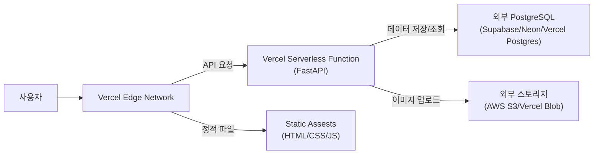

# FastAPI 애플리케이션 Vercel 배포 가이드

본 문서는 **FastAPI + SQLite** 기반의 `insta-lite` 프로젝트를 **Vercel**로 배포하기 위한 절차와 고려사항을 정리한 보고서입니다.

## 1. 개요 및 분석

*   **Platform**: Vercel
*   **Architecture**: Serverless Functions (AWS Lambda 기반)
*   **Key Issue**: Netlify와 마찬가지로 **Ephemeral Filesystem(일시적 파일 시스템)**을 사용합니다.

## 2. Vercel 배포 시 핵심 고려사항

Vercel 또한 정적 사이트 호스팅과 Serverless Function 제공에 최적화되어 있습니다. 따라서 Netlify와 동일한 **데이터 지속성(Persistence) 문제**가 발생합니다.

### ⚠️ SQLite 데이터베이스 초기화 문제
Vercel Function은 요청 처리 후 일정 시간이 지나면 종료되며, 이때 디스크에 저장된 모든 파일(예: `insta_lite.db`, `uploads/` 폴더 내 이미지들)은 **삭제됩니다.**

> **결론**: Vercel에 배포 시 **외부 데이터베이스(PostgreSQL, MySQL 등)와 외부 스토리지(AWS S3, Cloudinary 등)**를 반드시 사용해야 합니다.

---

## 3. Vercel 배포 아키텍처



---

## 4. Vercel 배포 단계별 가이드

### 4.1. 필수 패키지 설치
Vercel은 Python 런타임을 기본 지원하지만, FastAPI와의 원활한 연동을 위해 `requirements.txt`가 필요합니다. `mangum` 같은 어댑터는 Vercel의 경우 `vercel.json` 설정에 따라 필요 없을 수도 있지만, 표준 WSGI/ASGI 배포를 위해 사용하는 것이 일반적입니다. 하지만 최신 Vercel Python 런타임은 `app` 객체를 직접 찾을 수 있습니다.

**필수 파일 생성**:
```bash
uv pip compile pyproject.toml -o requirements.txt
```

### 4.2. `vercel.json` 설정 파일 생성 (핵심)
프로젝트 루트에 `vercel.json` 파일을 생성하여 Python 런타임과 라우팅을 설정합니다.

```json
{
  "builds": [
    {
      "src": "app.py",
      "use": "@vercel/python"
    }
  ],
  "routes": [
    {
      "src": "/(.*)",
      "dest": "app.py"
    }
  ]
}
```

### 4.3. 코드 수정 (`app.py`)
Vercel의 Serverless Function은 엔트리 포인트 변수명(보통 `app`)을 자동으로 찾습니다. 단, 정적 파일(`static`, `uploads`) 서빙은 Vercel 라우팅 레벨에서 처리하거나, 코드 내에서 절대 경로 문제 등을 신경 써야 합니다.
가장 깔끔한 방법은 `/static` 경로는 Vercel이 직접 서빙하게 하고, API 요청만 Python으로 넘기는 것입니다.

**개선된 `vercel.json` (정적 파일 분리)**:
```json
{
  "rewrites": [
    { "source": "/api/(.*)", "destination": "/api/index.py" }
  ]
}
```
*참고: Vercel의 추천 구조는 `api/` 폴더 안에 엔트리포인트를 두는 것입니다. 현재 구조(`root`에 `app.py`)를 유지하려면 위의 `builds` 설정 방식을 사용해야 합니다.*

### 4.4. Vercel CLI 또는 Git 연동 배포
1.  **Vercel CLI 설치**: `npm i -g vercel`
2.  **배포**: 터미널에서 `vercel` 명령어 입력 후 안내에 따라 진행.
3.  **Git 연동**: Github 리포지토리를 Vercel 대시보드에서  Import 합니다.
    *   **Framework Preset**: Other
    *   **Build Command**: (비워둠)
    *   **Install Command**: `pip install -r requirements.txt`

---

## 5. Netlify vs Vercel 비교

| 기능 | Netlify | Vercel |
| :--- | :--- | :--- |
| **Python 지원** | 커뮤니티 플러그인 등 필요할 수 있음 | `@vercel/python` 공식 런타임 지원 강력 |
| **설정 복잡도** | `mangum` 어댑터 필수 | 설정 파일로 비교적 쉽게 연동 가능 |
| **DB/스토리지** | 외부 서비스 필수 | **Vercel Postgres / Vercel Blob** 등 자사 통합 서비스 제공 (편리함) |
| **무료 티어** | 넉넉함 | 개인 프로젝트에 넉넉함 |

## 6. 결론 및 추천

Vercel은 Netlify보다 **Python Serverless 배포 경험이 조금 더 매끄럽습니다.** 또한 **Vercel Postgres**와 **Vercel Blob** 스토리지 서비스를 제공하므로, SQLite의 한계를 극복하기 위해 다른 클라우드(AWS 등)를 가입할 필요 없이 Vercel 생태계 안에서 해결할 수 있다는 큰 장점이 있습니다.

**추천 시나리오**:
*   **Vercel 배포**: DB를 **Vercel Postgres**로 전환할 의향이 있을 때 (가장 추천).
*   **Render 배포**: **SQLite**를 그대로 유지하고 싶을 때 (Disk 추가).

---
**작성일**: 2026-02-10
**작성자**: Google Antigravity
